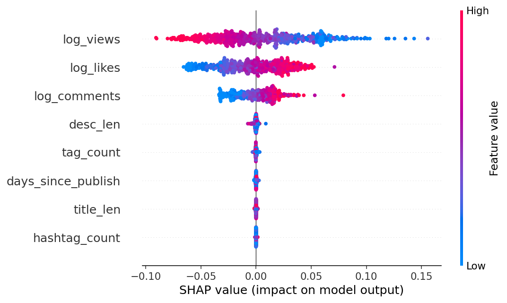
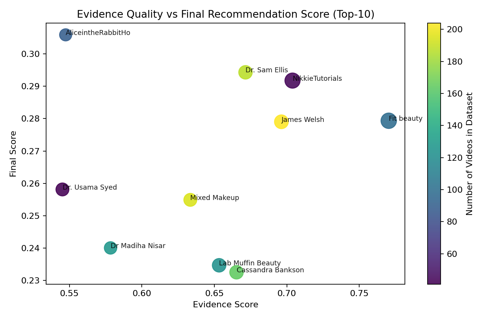
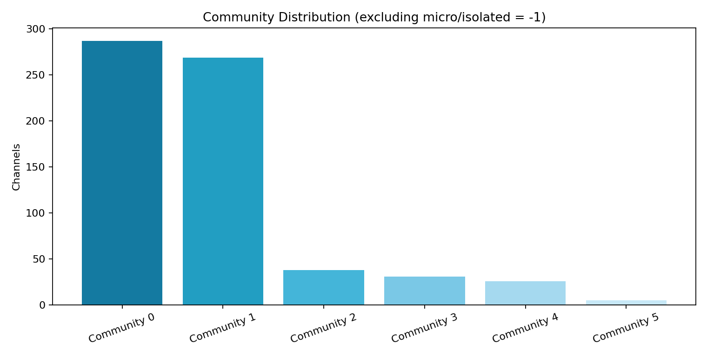
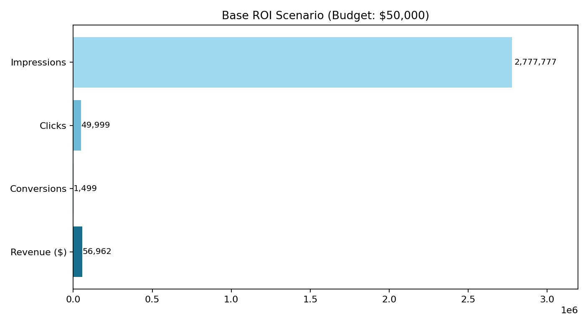

# AI-MCN: AI-Augmented Influencer Matching for Beauty Campaigns
## MSIS 521 Course Project (Team Presentation, 15 minutes)

- Team: [Add names]
- Course: MSIS 521
- Date: [Add date]
- Prototype: Streamlit app + Python pipeline

---

# 1) Problem and Client Context

**Client scenario (hypothetical but realistic):**
- Brand: **Beauty of Joseon (BOJ)**
- Product: **Relief Sun SPF + Glow Serum**
- Market: **United States**

**Business problem:**
- Influencer discovery is often slow and biased toward follower size.
- Brand teams need a repeatable way to find creators with:
  - topic relevance,
  - network influence,
  - evidence-backed performance,
  - transparent reasoning.

---

# 2) Why Beauty of Joseon? (Selection Rationale + Brand Research)

Why we selected BOJ:
- Clear and defensible campaign theme for the class demo: sunscreen + lightweight skincare.
- Distinct positioning for storytelling: heritage-inspired K-beauty with ingredient-focused messaging.
- Strong comparison design with CeraVe (different brand positioning, same skincare category).

Brand research snapshot (project-facing):
- Positioning: modernized K-beauty skincare brand with gentle, daily-use value proposition.
- Audience hypothesis: Gen Z/Millennial users focused on sensitive-skin-safe SPF and acne-aware routines.
- Campaign need: choose creators by contextual fit + evidence quality, not only popularity.

Dataset evidence supporting feasibility (`videos_text_ready_combined.csv`, n=67,283):
- `sunscreen`: 3,981 videos across 340 channels
- `spf`: 3,850 videos across 344 channels
- `k-beauty`: 636 videos across 76 channels
- `beauty of joseon`: 286 videos across 69 channels
- `cerave`: 747 videos across 118 channels

---

# 3) Project Scope (Well-Scoped for a Quarter)

**In-scope (prototype):**
- End-to-end AI matching workflow using existing YouTube dataset.
- Interactive campaign input -> ranked influencer shortlist.
- Explainable scoring + ML benchmark + ROI simulation + memo output.

**Out-of-scope (future work):**
- Live social listening ingestion from all platforms.
- Production-grade MLOps and A/B deployment infrastructure.

---

# 4) Assignment Requirements Check

This project satisfies the assignment requirements:
- Pick a client/problem: done (BOJ use case).
- Collect/obtain data: done (team-collected YouTube channel/video/comment data).
- Build AI prototype in Python: done (full pipeline + Streamlit demo).
- Prepare and present process, business story, and demo: done in this deck.

Deliverables prepared:
- Codebase: `/Users/alice/521_Marketing`
- Presentation deck: this file
- Demo app: `app.py` (English-only UI)

---

# 5) Data and Coverage

Data source:
- Team-collected YouTube API dataset (beauty-related channels/videos/comments).

Current run statistics (BOJ configuration):
- Videos analyzed: **42,750**
- Channels scored: **1,089**
- Top recommendations: **Top-10** default (user-adjustable in UI)

Files used:
- `data/videos_text_ready_combined.csv`
- `data/comments_raw_combined.csv`
- `data/master_prd_slim_combined.csv`

---

# 6) Method Overview (Hybrid AI Pipeline)

1. Data cleaning + beauty filter  
2. Channel-level aggregation  
3. Network scoring (SNA centralities + communities)  
4. Text relevance scoring (TF-IDF + keyword boost)  
5. Semantic/tone enrichment for top candidates  
6. Engagement and evidence quality scoring  
7. ML benchmarking (5-fold GroupCV)  
8. Final ranking with diversity guardrail  
9. ROI simulation + strategy generation + executive memo

---

# 7) Technical Stack and Modeling

**Core methods implemented:**
- Linear Regression, LASSO, Ridge
- CART (Decision Tree), Random Forest, LightGBM
- 5-fold GroupKFold CV (grouped by channel)
- SHAP explainability for tree best model

**Scoring design (multi-signal):**
- SNA + TF-IDF + Semantic + Tone + Engagement + ML potential
- Reliability penalty to down-rank weak-evidence channels

---

# 8) Model Evaluation Results (BOJ Run)

Best model: **LightGBM**

Selected CV RMSE:
- LightGBM: **0.00996**
- RandomForest: 0.01463
- CART: 0.02077
- Baseline Median: **0.03800**

Relative gain vs baseline:
- **73.8% lower RMSE** (from 0.03800 to 0.00996)

Visual:

---

# 9) Explainability (SHAP)

Why this matters:
- Helps non-technical stakeholders trust the ranking logic.
- Shows which feature patterns most influence predicted engagement potential.

Visual:

---

# 10) Top-10 BOJ Recommendations

Top recommendations from this run:
1. AliceintheRabbitHole  
2. Dr. Sam Ellis  
3. NikkieTutorials  
4. Fit beauty  
5. James Welsh  
6. Dr. Usama Syed  
7. Mixed Makeup  
8. Dr Madiha Nisar  
9. Lab Muffin Beauty Science  
10. Cassandra Bankson

Visual:

---

# 11) Quality Guardrails and Bias Mitigation

Guardrails implemented:
- Evidence-based penalty for tiny/low-signal channels.
- Community diversity selection in final list.

Bias diagnostic:
- Overlap between degree-only top-10 and hybrid top-10 = **2/10**
- Indicates reduced “popularity-only” bias.

Visual:

---

# 12) Network Diversity Findings

Community results (excluding micro/isolated channels):
- Non-micro communities discovered: **6**
- Largest non-micro community share: **43.8%**

Interpretation:
- Dataset has a dominant skincare cluster, but multiple communities remain.
- Diversity guardrail prevents all recommendations from collapsing to one bubble.

Visual:

---

# 13) ROI Scenario (Business Lens)

Base scenario assumptions:
- Budget: **$50,000**
- CPM: $18, CTR: 1.8%, CVR: 3.0%, AOV: $38

Estimated outcomes:
- Impressions: **2,777,777**
- Clicks: **49,999**
- Conversions: **1,499**
- Revenue: **$56,962**
- Expected ROAS: **1.14x** (range: 0.80x–1.48x)

Visual:

---

# 14) Demo Flow (What We Show Live)

1. Enter campaign input (brand/product/audience/keywords/budget).
2. Run analysis pipeline.
3. Inspect Top-N recommendations with rationale and evidence.
4. Switch ranking strategies (network-first, keyword-first, performance-first).
5. Explore Network Studio and Text Intelligence tabs.
6. Open ML Studio (model comparison + SHAP).
7. Adjust ROI assumptions in ROI Lab.
8. Export recommendation memo.

---

# 15) Real-World Impact

Who can use this:
- Brand managers
- Performance marketers
- Influencer/partnership teams
- Agencies

Potential impact:
- Faster shortlist generation
- More transparent creator selection
- Better risk control through evidence guardrails
- Stronger decision support for budget allocation

---

# 16) Limitations and Honest Caveats

- Current prototype uses a pre-collected YouTube dataset (not live multi-platform ingestion).
- ROI is a scenario simulation, not causal proof.
- Some channels are still concentrated in dominant communities.
- Live market/competitor web research is not yet automated in current run.

Planned next steps:
- Live data connectors + periodic refresh
- Stronger fairness/diversity constraints
- Controlled pilot measurement with real campaign data

---

# 17) Rubric Alignment (How We Target 9-10)

**(1) Topic choice, scope, interest**
- Clear, creative, and feasible scope: AI influencer matching + explainability + business outputs.

**(2) Potential impact and relevance**
- Directly tied to real marketing workflow (creator selection and campaign planning).

**(3) Technical aspects**
- Hybrid pipeline + multiple ML models + 5-fold GroupCV + SHAP + sanity checks.

**(4) Presentation quality and storytelling**
- Context -> data -> method -> demo -> impact arc.
- Visual-first slides and interactive prototype walkthrough.

---

# 18) Team Delivery Plan (15-Minute Timing)

- 0:00–2:00: Problem, client context, and scope
- 2:00–5:30: Data and method pipeline
- 5:30–8:30: Model evaluation + explainability
- 8:30–12:30: Live demo (app walkthrough)
- 12:30–14:00: Impact, limitations, roadmap
- 14:00–15:00: Q&A

Suggested speaking split:
- Speaker A: business context + scope
- Speaker B: data + methods
- Speaker C: demo + impact + Q&A

---

# 19) References

- Course assignment brief and rubric PDFs (Canvas)
- YouTube Data API documentation
- scikit-learn documentation (Linear/LASSO/Ridge/CART/RF, GroupKFold)
- LightGBM documentation
- SHAP documentation
- Streamlit documentation
