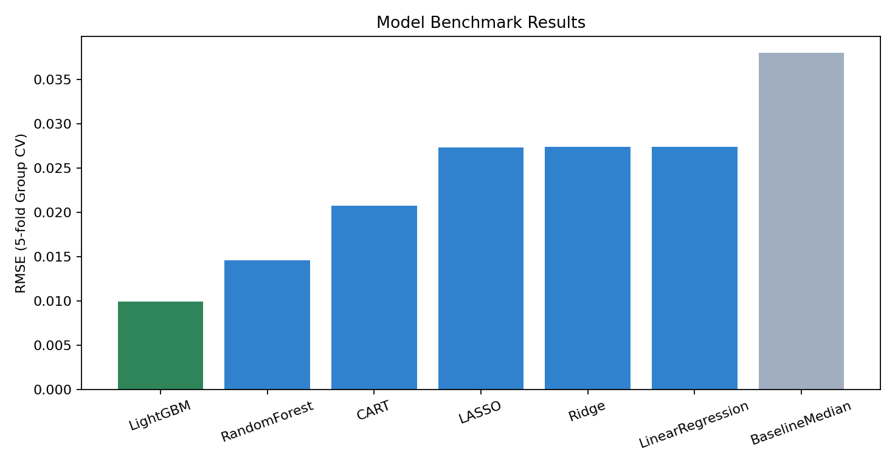
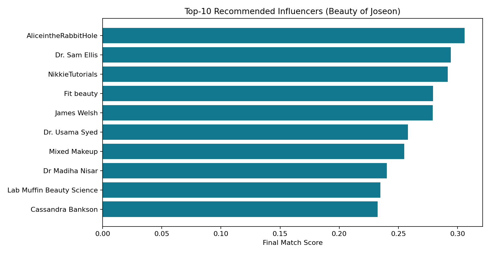

# AI-MCN: Replacing Traditional MCN Matching with an AI Decision System
## MSIS 521 Course Project (15-minute Presentation)

- Team: [Add names]
- Client case: Beauty of Joseon (BOJ), U.S. sunscreen campaign
- Prototype: Streamlit decision dashboard + Python AI pipeline

**Sources (this slide):**
- Internal: [PPT Builder](/Users/alice/521_Marketing/slides/build_pptx.py), [Project README](/Users/alice/521_Marketing/README.md)

---

# 1) Agenda and Timing (Professor Guide)

1. Title & team (1 min)
2. Business context & problem (2-3 min)
3. Data and features (1-3 min)
4. AI/ML approach (3-4 min)
5. Demo of prototype (3-4 min)
6. Impact, limitations, next steps (2-3 min)
7. How we used AI tools (1-2 min)

**Sources (this slide):**
- Class guideline shared by instructor (MSIS 521 presentation structure)

---

# 2) Business Context: Why This Problem Matters

What MCN-like workflows do:
- Aggregate creator/channel data
- Link creators to brand campaigns
- Manage monetization and content rights operations

Client pain point:
- Brands pay coordination overhead but still face opaque matching and expensive mismatch risk.

Our objective:
- Build an AI system that helps brands directly identify best-fit influencers with transparent evidence.

**Sources (this slide):**
- [YouTube Help: Link channels to your Content Manager](https://support.google.com/youtube/answer/106934?hl=en-EN)
- [YouTube Help: Set up Content ID as an MCN](https://support.google.com/youtube/answer/7296308?hl=en-GB)
- [IAB Creator Economy Ad Spend Report press release](https://www.iab.com/news/creator-economy-ad-spend-to-reach-37-billion-in-2025-growing-4x-faster-than-total-media-industry-according-to-iab/)

---

# 3) Client and Decision to Improve

Client scenario:
- Brand: Beauty of Joseon (BOJ)
- Product: Relief Sun SPF + Glow Serum
- Market: United States

Decision/process to improve:
- From: popularity-led/manual creator selection
- To: product-specific, evidence-based, explainable creator ranking

Key decision questions:
- Who is the best-fit creator for this product and audience?
- How can we reduce mismatch risk before spending budget?

**Sources (this slide):**
- Internal brief and app form: [app.py](/Users/alice/521_Marketing/app.py)
- External context: [Fashionista BOJ US strategy article (Nov 13, 2024)](https://fashionista.com/2024/11/beauty-of-joseon-k-beauty-skin-care-us-launch-strategy)

---

# 4) Why Now: Market Research Evidence

Macro signals:
- U.S. influencer marketing spend expected to reach **$10.52B in 2025**.
- U.S. creator-economy ad spend projected at **$37B in 2025** (IAB framing).
- Global beauty value grew **7.3% YoY** (NIQ, 2025).
- Beauty core segments expected to reach about **$590B by 2030** (McKinsey).

Strategic implication:
- Influencer selection is now a high-stakes budget decision, not a side tactic.

**Sources (this slide):**
- [EMARKETER press release (Mar 13, 2025)](https://www.emarketer.com/press-releases/us-influencer-marketing-spending-will-surpass-10-billion-in-2025/)
- [IAB Creator Economy report press release (Nov 20, 2025)](https://www.iab.com/news/creator-economy-ad-spend-to-reach-37-billion-in-2025-growing-4x-faster-than-total-media-industry-according-to-iab/)
- [NIQ beauty growth press release (Feb 25, 2025)](https://nielseniq.com/global/en/news-center/2025/niq-reports-7-3-year-over-year-value-growth-in-global-beauty-sector/)
- [McKinsey beauty outlook (Aug 28, 2025)](https://www.mckinsey.com/industries/consumer-packaged-goods/our-insights/a-close-look-at-the-global-beauty-industry-in-2025)

---

# 5) Why Beauty and Why BOJ

Why beauty:
- Large social-commerce overlap and high creator influence on purchase behavior.

Why BOJ:
- Strong viral sunscreen narrative + clear U.S. expansion storyline.
- Product/audience definition is clear enough for explainable matching demo.

BOJ-specific external signals:
- U.S. pop-up and U.S.-adapted sunscreen strategy highlighted in public coverage.
- BOJ official pop-up campaign pages support the activation narrative.

**Sources (this slide):**
- [Fashionista BOJ U.S. expansion feature](https://fashionista.com/2024/11/beauty-of-joseon-k-beauty-skin-care-us-launch-strategy)
- [Beauty of Joseon official Rice Wonderland page](https://beautyofjoseon.com/pages/rice-wonderland)
- [FDA Sunscreen Innovation Act page](https://www.fda.gov/drugs/guidance-compliance-regulatory-information/sunscreen-innovation-act-sia)
- [SAFE Sunscreen Standards Act (House)](https://www.congress.gov/bill/119th-congress/house-bill/3686)

---

# 6) Data and Features

Data source:
- Team-collected YouTube API exports (videos/comments/channel fields)

Pipeline scale in our full-run setup:
- Videos analyzed: 42,750
- Channels scored: 1,089

Feature groups:
- Network features: centrality, communities
- Text features: TF-IDF, semantic/tone matching
- Performance features: views/likes/comments/engagement
- Reliability features: evidence score, credibility multiplier

**Sources (this slide):**
- Internal data files: [data/](/Users/alice/521_Marketing/data)
- Internal pipeline: [data_prep.py](/Users/alice/521_Marketing/src/data_prep.py), [orchestrator.py](/Users/alice/521_Marketing/src/orchestrator.py)
- [YouTube Data API reference](https://developers.google.com/youtube/v3)

---

# 7) Preprocessing + EDA

Preprocessing:
- Deduplication and numeric/date normalization
- Beauty include-filter and noise exclude-filter
- Channel-level aggregation and recency tracking

EDA examples used in the story:
- Community distribution
- Score breakdown across top channels
- Keyword coverage checks

Takeaway:
- Cluster concentration exists, so diversity and reliability controls are necessary.

**Sources (this slide):**
- Internal preprocessing code: [data_prep.py](/Users/alice/521_Marketing/src/data_prep.py)
- Internal visual outputs: [slides/assets/community_distribution_clean.png](/Users/alice/521_Marketing/slides/assets/community_distribution_clean.png), [slides/assets/top10_final_scores.png](/Users/alice/521_Marketing/slides/assets/top10_final_scores.png)

---

# 8) AI/ML Approach (Course Concepts First)

Methods emphasized from class content:
1. Social Network Analysis (SNA): graph, centrality, communities
2. Text relevance: TF-IDF and semantic alignment
3. Regression models: Linear/LASSO/Ridge/CART/RF/LightGBM
4. Validation: GroupKFold(5)
5. Explainability: SHAP

Extensions shown in demo (not deep-dived in talk):
- ROI scenario, strategy generation, executive memo

**Sources (this slide):**
- Internal modules: [network_scoring.py](/Users/alice/521_Marketing/src/network_scoring.py), [text_scoring.py](/Users/alice/521_Marketing/src/text_scoring.py), [ml_modeling.py](/Users/alice/521_Marketing/src/ml_modeling.py)
- [scikit-learn GroupKFold docs](https://scikit-learn.org/stable/modules/generated/sklearn.model_selection.GroupKFold.html)
- [LightGBM docs](https://lightgbm.readthedocs.io/en/latest/)
- [SHAP docs](https://shap.readthedocs.io/en/latest/)

---

# 9) Why This Method (vs Simpler Alternatives)

Why not follower-count only:
- It misses campaign language fit, network position, and reliability evidence.

Why hybrid:
- SNA captures influence structure
- Text scoring captures campaign fit
- ML estimates engagement potential
- Reliability/diversity controls reduce risky recommendations

Governance note:
- Influencer disclosure and endorsement compliance still matter in deployment.

**Sources (this slide):**
- [FTC Influencer Disclosures 101](https://www.ftc.gov/influencers)
- [FTC Endorsement Guides overview](https://www.ftc.gov/business-guidance/resources/ftcs-endorsement-guides)
- [YouTube MCN operations reference](https://support.google.com/youtube/answer/7296308?hl=en-GB)

---

# 10) Model Evaluation Results

BOJ run summary:
- Best model: LightGBM
- RMSE: 0.00996
- Baseline RMSE: 0.03800
- Relative improvement: 73.8% lower RMSE

Interpretation:
- Predictive block shows meaningful value over naive baseline.

Visual:

**Sources (this slide):**
- Internal results: [presentation_summary_boj.json](/Users/alice/521_Marketing/artifacts/reports/presentation_summary_boj.json)
- Internal metrics file: [ml_cv_results.csv](/Users/alice/521_Marketing/artifacts/reports/ml_cv_results.csv)
- Internal plot: [model_benchmark_rmse.png](/Users/alice/521_Marketing/slides/assets/model_benchmark_rmse.png)

---

# 11) Prototype Demo (Input -> Output)

Live flow shown in class:
1. Campaign brief input
2. Top-N influencer recommendations
3. Channel-level rationale/risk/details
4. Network, text, ML, ROI tabs for decision support

Use cases:
- BOJ launch shortlist generation
- CeraVe benchmark calibration

Visual:

**Sources (this slide):**
- App entry point: [app.py](/Users/alice/521_Marketing/app.py)
- Pipeline runner: [run_pipeline.py](/Users/alice/521_Marketing/run_pipeline.py)
- Internal output CSV: [top10_beauty_of_joseon.csv](/Users/alice/521_Marketing/artifacts/reports/top10_beauty_of_joseon.csv)

---

# 12) Business Impact

Decision impact for brands:
- Faster shortlisting
- More transparent creator selection
- Lower mismatch risk before spending
- Better expected-outcome planning via scenario ROI

Why this matters now:
- Creator investment is becoming a core media line item.

**Sources (this slide):**
- [IAB creator ad spend report press release](https://www.iab.com/news/creator-economy-ad-spend-to-reach-37-billion-in-2025-growing-4x-faster-than-total-media-industry-according-to-iab/)
- [EMARKETER influencer forecast press release](https://www.emarketer.com/press-releases/us-influencer-marketing-spending-will-surpass-10-billion-in-2025/)
- [YouTube 2024 U.S. Impact Report blog](https://blog.youtube/news-and-events/2024-us-youtube-impact-report/)

---

# 13) Limitations, Ethics, and Next Steps

Limitations:
- Pre-collected YouTube dataset (not full live ingestion)
- ROI is scenario-based, not causal proof
- Community concentration still exists

Ethics/compliance:
- Need disclosure compliance for sponsorships
- Need robust governance for authenticity/counterfeit risk and brand safety

Next steps:
- Live multi-platform connectors
- Stronger fairness constraints and experiment loop
- Operationalization for weekly planning

**Sources (this slide):**
- [FTC Influencer Disclosures 101](https://www.ftc.gov/influencers)
- [SAFE Sunscreen Standards Act (Senate)](https://www.congress.gov/bill/119th-congress/senate-bill/2491)
- [SAFE Sunscreen Standards Act (House)](https://www.congress.gov/bill/119th-congress/house-bill/3686)
- [FDA Sunscreen Innovation Act background](https://www.fda.gov/drugs/guidance-compliance-regulatory-information/sunscreen-innovation-act-sia)

---

# 14) How We Used AI Tools

AI tools were used for:
- idea generation and scope refinement
- implementation acceleration and debugging
- documentation and presentation drafting

Human ownership remained on:
- framing the business problem
- selecting/validating methods
- interpreting outputs and deciding recommendations

**Sources (this slide):**
- Internal development artifacts and commit history

---

# 15) Consolidated References and Q&A

Priority external references used in this deck:
- [EMARKETER (Mar 13, 2025)](https://www.emarketer.com/press-releases/us-influencer-marketing-spending-will-surpass-10-billion-in-2025/)
- [IAB Creator Economy Report press release (Nov 20, 2025)](https://www.iab.com/news/creator-economy-ad-spend-to-reach-37-billion-in-2025-growing-4x-faster-than-total-media-industry-according-to-iab/)
- [YouTube 2024 U.S. Impact Report (Jun 10, 2025)](https://blog.youtube/news-and-events/2024-us-youtube-impact-report/)
- [NIQ Beauty Growth Press Release (Feb 25, 2025)](https://nielseniq.com/global/en/news-center/2025/niq-reports-7-3-year-over-year-value-growth-in-global-beauty-sector/)
- [McKinsey Beauty Outlook (Aug 28, 2025)](https://www.mckinsey.com/industries/consumer-packaged-goods/our-insights/a-close-look-at-the-global-beauty-industry-in-2025)
- [Goldman Sachs Creator Economy analysis](https://www.goldmansachs.com/insights/articles/the-creator-economy-could-approach-half-a-trillion-dollars-by-2027)
- [Yonhap: Korea cosmetics exports ($10.2B, Jan 6, 2025)](https://en.yna.co.kr/view/AEN20250106003100320)
- [Fashionista BOJ U.S. feature (Nov 13, 2024)](https://fashionista.com/2024/11/beauty-of-joseon-k-beauty-skin-care-us-launch-strategy)
- [BOJ official Rice Wonderland page](https://beautyofjoseon.com/pages/rice-wonderland)
- [FTC Influencer Disclosures 101](https://www.ftc.gov/influencers)
- [YouTube Help: Link channels to Content Manager](https://support.google.com/youtube/answer/106934?hl=en-EN)
- [YouTube Help: MCN Content ID setup](https://support.google.com/youtube/answer/7296308?hl=en-GB)
- [FDA SIA page](https://www.fda.gov/drugs/guidance-compliance-regulatory-information/sunscreen-innovation-act-sia)
- [SAFE Sunscreen bill (House)](https://www.congress.gov/bill/119th-congress/house-bill/3686)
- [SAFE Sunscreen bill (Senate)](https://www.congress.gov/bill/119th-congress/senate-bill/2491)

Q&A
